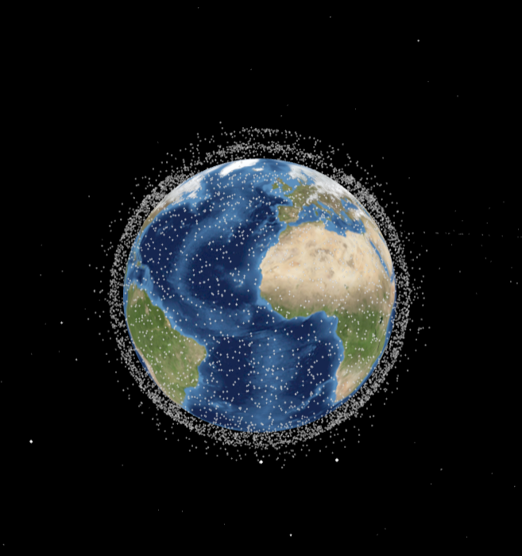

# Satelite3D

This web app uses TLE data to plot satellites in a 3D environment. The TLE data is processed to generate spherical coordinates relative to the globe and predict future satellite positions.

This project is in its early stages and will be expanded with additional features over time.

Further additions I would like to implement include:
- Optimizing the prediction and graphical representation of the 10,000 Satellites
- Ability to learn about a specific Satellite by clicking on it
- Showing the predicted path of a Satellite with a glowing line
- Custumizablity of time, show past satellites path (ex. 1989)

This project was inspired by **Marko Andlar's 3D Satellite Tracker** - [SatelliteTracker3d](https://satellitetracker3d.com/)

## 3D Satellite Visualization

